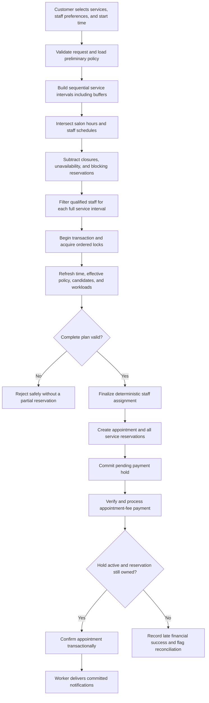
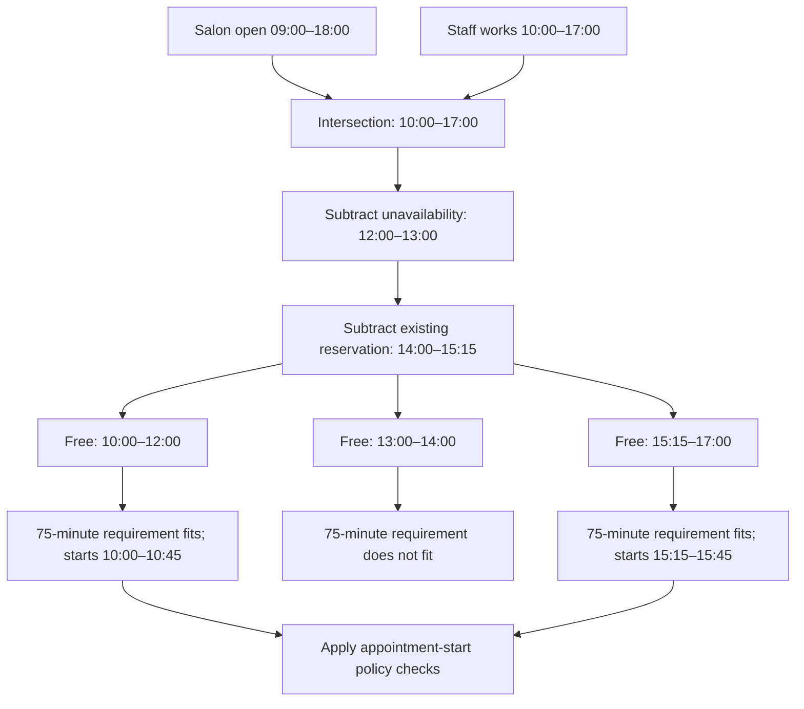
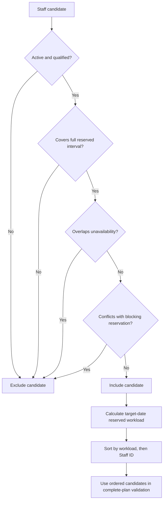
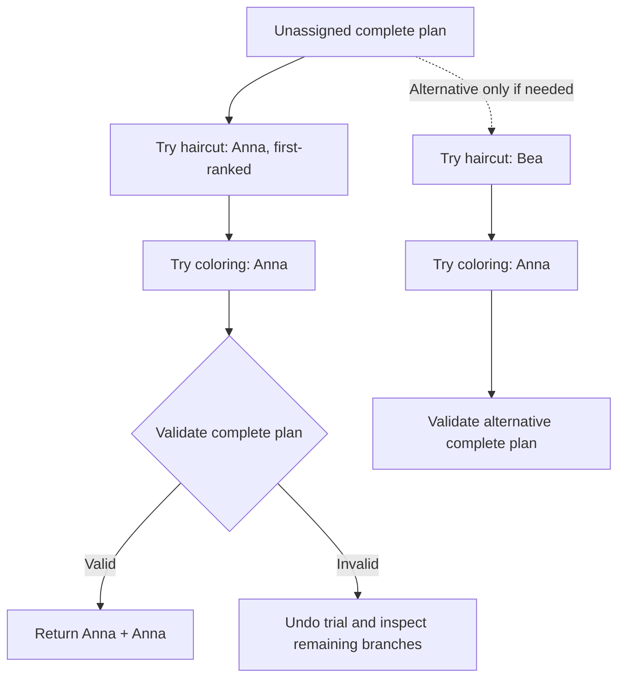
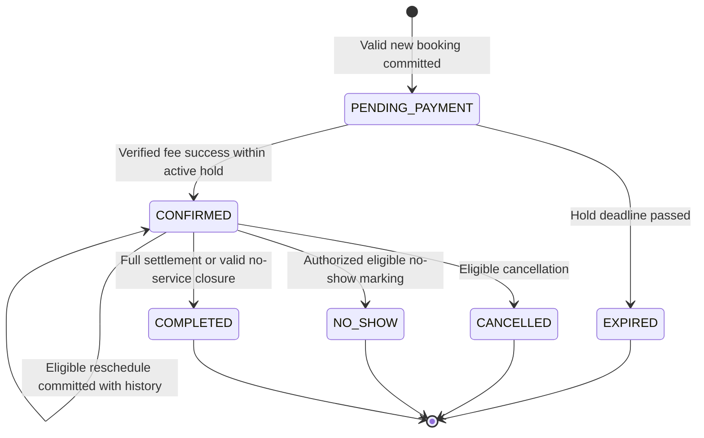
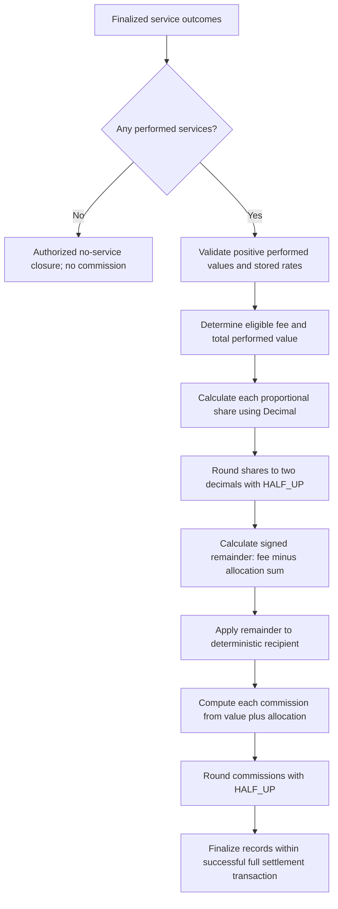
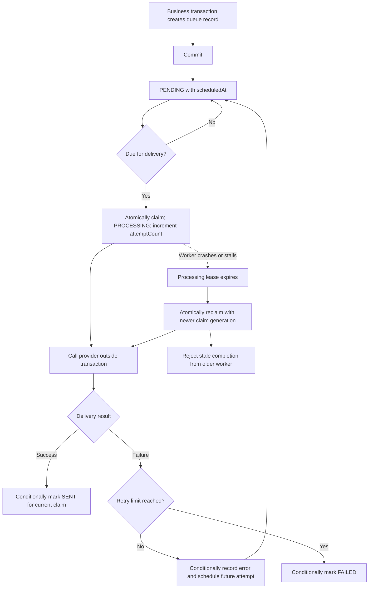

# Algorithms for the Salon Booking and Appointment System

This report explains the algorithms and processing techniques suitable for the documented MVP, with worked examples and conceptual pseudocode. It describes a design; it does not claim these algorithms are already implemented or introduce new business rules.

The authoritative references remain [SYSTEM_RULES.md](SYSTEM_RULES.md), [DATABASE_MODEL.md](DATABASE_MODEL.md), and [ARCHITECTURE.md](ARCHITECTURE.md). Their rules take precedence over this explanatory report. Examples use salon-local times on the same date unless stated otherwise. Monetary examples use PHP.

## 1. Overview

The central scheduling approach is constraint-based scheduling: accept a reservation only when all required constraints pass. The system combines interval operations, sequential schedule construction, deterministic staff ranking, and complete-plan validation.

| Algorithm or technique | Main purpose | Governing reference |
|---|---|---|
| Interval overlap detection | Detect conflicting staff reservations | System Rules §§9–11, 32 |
| Interval intersection and subtraction | Calculate usable availability | System Rules §8; Architecture §20 |
| Sequential scheduling | Construct a multi-service appointment | System Rules §13 |
| Least-workload selection | Rank eligible staff deterministically | System Rules §7 |
| Bounded backtracking | Search for a feasible complete staff assignment | System Rules §7; Architecture §22 |
| Finite-state machine | Enforce valid lifecycle transitions | System Rules §§14–20, 27 |
| Proportional allocation and rounding | Calculate fee allocations and commissions | System Rules §28 |
| Idempotency-key deduplication | Make repeated payment processing safe | System Rules §19; Architecture §24 |
| Due-time queue processing | Deliver notifications with retry and recovery | Architecture §27 |
| Ordered locking and transactional revalidation | Make concurrent booking decisions safe | Architecture §§17–21 |

Some entries are classical algorithms; others are state-management or concurrency techniques. They work together and should not be presented as interchangeable scheduling algorithms.

### System-wide algorithm flow



This overview omits some error branches for readability. Every mutation follows its workflow-specific locking and validation rules; the payment phase has its own protected transaction.

## 2. Interval overlap detection

### Purpose and rule

Check whether a proposed service conflicts with another reservation for the same staff member. The authoritative scheduling unit is `AppointmentService`, not the overall appointment summary.

Represent a reservation as a half-open interval:

```text
[scheduledStartAt, reservedUntilAt)
```

The start is included and the ending instant is excluded. This permits a new reservation to start exactly when an earlier one ends.

Two intervals overlap when:

```text
newStart < existingReservedEnd
AND
newReservedEnd > existingStart
```

The reserved end includes the service buffer.

### Worked example

Anna has a haircut booked from 10:00 to 11:00, followed by a 15-minute buffer. Her reserved interval is therefore `[10:00, 11:15)`.

| Proposed reservation | Result | Explanation |
|---|---|---|
| 09:00–10:00 | Allowed by the overlap check | Ends exactly at the existing start |
| 09:30–10:30 | Conflict | Overlaps the beginning |
| 11:00–11:30 | Conflict | Overlaps Anna's buffer |
| 11:15–12:00 | Allowed by the overlap check | Starts exactly at the reserved end |

Passing this check does not prove that all other booking requirements pass.

### Reservation timeline

```text
Time             10:00                  11:00      11:15       12:00
Anna             |------ treatment ------|-- buffer --|
Reserved         [===================================)

Request A                                [====================)
                 Starts 11:00: overlaps the buffer → REJECT

Request B                                             [=======)
                 Starts 11:15: intervals are adjacent → NO OVERLAP
```

### Conceptual pseudocode

```text
overlaps(a, b):
    return a.start < b.reservedEnd AND a.reservedEnd > b.start

hasConflict(staffId, proposed, reservations, currentTime):
    for reservation in reservations:
        if reservation.staffId != staffId:
            continue
        if reservation.lifecycle != ACTIVE:
            continue
        if blocksAccordingToSystemRules(reservation, currentTime):
            if overlaps(proposed, reservation):
                return true
    return false
```

### Important state rules

- `PENDING_PAYMENT` blocks while `currentTime <= holdExpiresAt`.
- `CONFIRMED` blocks its reserved intervals.
- `COMPLETED` does not release time early: original intervals remain blocking until their reserved ends.
- `CANCELLED`, `NO_SHOW`, and `EXPIRED` do not block after the corresponding state change succeeds.
- Removed service rows never block.

The expiry worker is not required to have updated an expired hold's stored status before availability stops treating it as blocking.

One interval comparison takes O(1) time. Scanning n relevant reservations takes O(n). Database filtering and suitable indexes can reduce the records examined; an interval tree is not necessary for the initial MVP.

## 3. Interval intersection and subtraction

### Purpose

Find the time windows during which a staff member could perform a service. Begin with overlapping salon and staff working hours, then remove blocked periods.

```text
baseWindows = intersection(salonHours, staffSchedule)
blockedWindows = union(closures, staffUnavailability, blockingReservations)
freeWindows = subtract(baseWindows, blockedWindows)
```

Qualifications and active status are additional eligibility checks, not time intervals. Lead time and advance-booking limits also restrict which appointment starts may be offered.

### Worked example

Assume:

- Salon opening hours: 09:00–18:00.
- Anna's work schedule: 10:00–17:00.
- Anna's unavailable period: 12:00–13:00.
- Existing reservation, including buffer: 14:00–15:15.

Intersecting salon and staff hours gives `10:00–17:00`.

Subtracting unavailable and reserved periods gives:

```text
10:00–12:00
13:00–14:00
15:15–17:00
```

A service with 60 minutes of treatment and 15 minutes of buffer requires 75 uninterrupted minutes. Its possible start ranges are:

| Free window | Valid starts before other policy checks |
|---|---|
| 10:00–12:00 | 10:00 through 10:45, inclusive |
| 13:00–14:00 | None; the window is only 60 minutes |
| 15:15–17:00 | 15:15 through 15:45, inclusive |

These are continuous ranges. This example does not establish a 15-minute slot grid or another new booking policy.

### Implementation approach

Sort intervals by start time, merge overlapping blocked intervals, and scan the available windows while subtracting blocked sections. Sorting k intervals takes O(k log k); merging and subtraction can then be linear in the number of intervals processed.

Availability is calculated dynamically. The approved architecture does not call for permanently stored `TimeSlot` or `AvailabilitySlot` entities.

### Availability derivation diagram



## 4. Sequential scheduling

### Purpose

Construct the timeline for multiple services selected by one customer. The customer's services are sequential; different customers may still be served in parallel by different staff members.

For each service:

```text
scheduledEnd = scheduledStart + duration
reservedUntil = scheduledEnd + buffer
nextServiceStart = reservedUntil
```

### Worked example

The customer selects a haircut, coloring, and styling, beginning at 09:00.

| Service | Duration | Buffer | Service interval | Reserved until |
|---|---:|---:|---|---|
| Haircut | 60 min | 15 min | 09:00–10:00 | 10:15 |
| Coloring | 120 min | 15 min | 10:15–12:15 | 12:30 |
| Styling | 30 min | 0 min | 12:30–13:00 | 13:00 |

The appointment starts at 09:00 and ends at 13:00. If styling had a 15-minute buffer, the appointment summary would still end at 13:00, while its assigned staff member would remain reserved until 13:15.

### Conceptual pseudocode

```text
buildPlan(appointmentStart, serviceSnapshots):
    cursor = appointmentStart
    plan = []

    for service in serviceSnapshots in sequence order:
        end = cursor + service.duration
        reservedEnd = end + service.buffer
        plan.append(service, cursor, end, reservedEnd)
        cursor = reservedEnd

    return plan
```

Construction takes O(m) for m services. It creates a proposed timeline; staff eligibility and availability still need validation.

Retained services during ordinary rescheduling preserve their original duration, price, buffer, and commission snapshots. New services use the applicable current values. A service's explicit zero buffer must remain zero; only an absent buffer falls back to the governing policy default.

## 5. Least-workload staff selection

### Purpose

Rank staff for “Any Available Staff” using the system's required deterministic rule.

First remove anyone who is inactive, unqualified, unable to cover the full interval, unavailable, or already reserved. Then rank the remaining candidates by:

```text
1. Reserved workload for the target salon-local date, ascending
2. Staff ID, ascending
```

Workload is the total reserved minutes from blocking `PENDING_PAYMENT` and `CONFIRMED` service intervals for that date, including buffers. This workload definition is distinct from conflict blocking: `COMPLETED` intervals can still block time even though the stated workload metric names only the first two states.

### Worked example

For a haircut at 10:00, the initial candidate information is:

| Staff | ID | Reserved workload | Eligible for requested interval? |
|---|---:|---:|---|
| Anna | 10 | 180 min | Yes |
| Bea | 20 | 120 min | Yes |
| Carlo | 30 | 120 min | Yes |
| Dana | 40 | 60 min | No: unavailable at 10:00 |

Dana is removed before ranking. Bea ranks first because she has less workload than Anna and a lower ID than Carlo.

This selects the least-loaded eligible candidate according to the documented metric. It does not promise equal revenue, equal commission, or globally optimal scheduling across all customers.

Ranking s eligible candidates takes O(s log s). Selecting only the minimum takes O(s), but a sorted candidate list is useful when searching complete multi-service assignments.

### Staff-selection decision diagram



## 6. Bounded backtracking and complete-plan validation

### Purpose

Avoid finalizing a partial assignment before confirming that the entire appointment can be served. Backtracking explores candidate combinations and abandons a branch if it cannot produce a valid complete plan.

Use candidate ordering from the least-workload rule and keep specific-staff selections fixed. Backtracking must not silently substitute someone else for explicitly selected staff.

### Conceptual pseudocode

```text
search(serviceIndex, assignment):
    if serviceIndex == numberOfServices:
        return assignment if completePlanIsValid(assignment) else failure

    for staff in orderedCandidates[serviceIndex]:
        if validWithCurrentPartialPlan(staff, serviceIndex, assignment):
            tentativelyAssign(staff, serviceIndex)
            result = search(serviceIndex + 1, assignment)
            if result succeeds:
                return result
            undoTentativeAssignment(serviceIndex)

    return failure
```

### Worked MVP example

The customer's sequential plan is:

| Service | Reserved interval | Eligible candidates in ranking order |
|---|---|---|
| Haircut | 09:00–10:15 | Anna, Bea |
| Coloring | 10:15–12:30 | Anna |

The search tries Anna for the haircut, then Anna for coloring. That complete assignment is valid because the intervals are adjacent, not overlapping.

If the coloring interval has no qualified available staff, the entire plan fails. Assigning Bea to the earlier haircut would not make Anna available later if she was already blocked by another appointment at the coloring time.

### Why this distinction matters

Under the current rules, service times are fixed by sequence, duration, and buffer. Different services within the same appointment do not overlap. Consequently, many MVP cases can be solved by constructing each service's eligible candidate list and checking that all lists are nonempty, then applying the deterministic preference.

It would be misleading to claim that assigning Anna to a haircut automatically prevents her from performing an adjacent coloring service. Backtracking is an allowed complete-plan search mechanism, not proof that every ordinary booking requires a combinatorial search. New cross-service constraints must not be invented merely to justify it.

For m services with at most s candidates each, a generic exhaustive search can examine O(s^m) complete combinations, plus validation work. Early filtering reduces the search space. If an implementation imposes a search bound and reaches it before finishing, it must not accept a partial plan or claim that infeasibility has been proved. Handling that limit requires an explicit implementation decision.

### Search-tree diagram for the example



The worked example succeeds on the first branch. The diagram shows where undoing and trying another branch occurs in the general search; it does not assert that the first branch fails in this example.

## 7. Finite-state machine

### Purpose

Represent allowed lifecycle changes as transitions with prerequisites, sometimes called guards. Appointment state and payment state remain separate.

| Current appointment state | Event and prerequisites | Next state |
|---|---|---|
| PENDING_PAYMENT | Verified fee success processed while hold is active and reservation ownership is valid | CONFIRMED |
| PENDING_PAYMENT | Current time passes the hold deadline | EXPIRED |
| CONFIRMED | Eligible cancellation succeeds | CANCELLED |
| CONFIRMED | Authorized no-show workflow succeeds | NO_SHOW |
| CONFIRMED | Outcomes, full required service payment, and commissions are finalized | COMPLETED |
| CONFIRMED | Every service is NOT_PERFORMED and authorized no-service closure succeeds | COMPLETED |

Ordinary rescheduling updates an eligible confirmed appointment; `RESCHEDULED` is not a status. No-show recovery is a separate workflow that creates a replacement appointment.

### Appointment state diagram



This depicts an ordinary appointment lifecycle. No-show recovery creates a separate appointment and does not reopen the old NO_SHOW record. Terminal lifecycle state also does not mean records are deleted or financial reconciliation is impossible.

### Worked deadline example

A pending appointment has `holdExpiresAt = 10:10:00`.

- Processing verified payment success at exactly 10:10:00 can confirm it, if the other prerequisites pass.
- Processing success after 10:10:00 cannot automatically confirm it.
- A late successful capture must still be recorded accurately as a financial transaction and flagged for reconciliation. Its appointment remains or becomes expired.

If payment processing began at 10:09:58 but waited for a lock until 10:10:03, the decision uses the fresh time after that wait. A stale request-start timestamp must not extend the hold.

Transition lookup can be O(1); actual guards require database validation. State transitions must run within the appropriate transaction, not through an unrestricted status-update endpoint.

## 8. Proportional fee allocation and commission calculation

### Purpose and formulas

Distribute the eligible collected, non-refunded appointment fee across performed services according to service value, then calculate each service's commission using its stored rate.

```text
allocation_i = eligibleFee × performedValue_i / totalPerformedValue
commissionBase_i = performedValue_i + finalizedAllocation_i
commission_i = commissionBase_i × storedCommissionRate_i
```

Only performed services participate. Final commission is calculated during successful full service-payment settlement, not when initially booking.

### Worked example

Eligible fee: PHP 100.00. Anna performs a PHP 500.00 service at a stored 10% commission rate. John performs a PHP 1,000.00 service at a stored 15% rate. The rates here are illustrative snapshots, not system defaults.

| Calculation | Anna | John |
|---|---:|---:|
| Service value | 500.00 | 1,000.00 |
| Exact proportional fee share | 100 × 500 / 1,500 | 100 × 1,000 / 1,500 |
| Rounded fee allocation | 33.33 | 66.67 |
| Commission base | 533.33 | 1,066.67 |
| Commission rate | 10% | 15% |
| Final commission | 53.33 | 160.00 |

The allocations total PHP 100.00. This allocation is for commission calculation; it does not turn the separately charged appointment fee into a discount on the service payment.

### Rounding remainder example

Three equally priced performed services share a PHP 100.00 fee. Each exact share is one-third of the fee. Rounding each share gives PHP 33.33, totaling PHP 99.99.

The remaining PHP 0.01 is assigned using the required order:

1. Highest performed service amount.
2. Lowest service sequence number if amounts tie.
3. Lowest AppointmentService ID if still tied.

For equal prices and sequences 1, 2, and 3, final allocations are PHP 33.34, PHP 33.33, and PHP 33.33. If initial rounding over-allocates, the signed negative remainder reduces the selected allocation instead.

Use Decimal arithmetic and ROUND_HALF_UP, not binary floating-point arithmetic. If every service is NOT_PERFORMED, use the no-service closure: no fee allocation, commission record, or artificial zero-value service payment is created.

Calculation takes O(m) for m performed services, including finding the deterministic remainder recipient.

### Commission calculation diagram



## 9. Idempotency-key deduplication

### Purpose

Ensure that processing the same logical payment more than once has only one financial effect. Duplicate requests are normal when providers retry callbacks or clients retry after a timeout.

### Worked example

A provider reports successful transaction `TX-901` three times.

| Delivery | Required behavior |
|---|---|
| First valid event | Record the payment and perform the permitted business effects |
| Duplicate event | Recognize the existing transaction; do not create another payment or receipt |
| Another duplicate | Return an appropriate existing outcome without repeating effects |

Two concurrent deliveries must also be safe. A plain “check whether the key exists, then insert” sequence outside transactional protection is insufficient: both requests can observe that it is absent.

### Processing approach

```text
authenticate or verify provider event
verify transaction identity, appointment, amount, currency, capture status
begin protected transaction
    acquire the required locks in the approved order
    resolve stable transaction identity using database uniqueness
    if already processed:
        return existing outcome
    evaluate fresh time and business prerequisites
    record financial truth and permitted business effects atomically
commit
```

Uniqueness enforcement must be backed by the database. Reusing a key with a different amount or appointment must not be treated as a valid replay.

A service settlement must not duplicate payment, receipt, commission records, or collection totals. The MVP also limits each appointment to one successful service payment, even if different request keys are submitted. Idempotency alone does not replace that separate business constraint.

## 10. Due-time notification processing, retries, and leases

### Purpose

Send notifications after the related business transaction commits, while tolerating temporary provider failures and worker crashes.

The approved architecture uses the existing PostgreSQL-backed `NotificationQueue`. It does not require Redis, RabbitMQ, or a new queue entity.

### Processing sequence

1. Insert the notification queue record within the booking or payment transaction.
2. After commit, a worker atomically claims a due PENDING record in a short transaction.
3. Mark it PROCESSING, increment `attemptCount`, and record claim time.
4. Contact the provider outside the database transaction.
5. Record SENT, or schedule a bounded retry; mark FAILED when retries are exhausted.
6. Permit reclaiming abandoned PROCESSING work after its processing lease expires.

Completion and retry updates must match the current claim generation. Otherwise a slow worker could overwrite a newer worker's result.

### Worked retry example

A booking commits at 09:00, and its confirmation email enters the queue. The first delivery attempt fails because the provider is temporarily unavailable.

An illustrative retry strategy is exponential backoff:

```text
delay = min(maxDelay, baseDelay × 2^(failureNumber - 1))
```

With a one-minute base, retries might be scheduled one minute after the first failure, two minutes after the second, and four minutes after the third. These delay values and exponential backoff are implementation options, not existing booking-policy defaults. A maximum attempt count must bound retries.

### Worked crash example

Worker A claims attempt 1 and stalls. After the lease expires, worker B reclaims the record as attempt 2. If worker A later returns, its attempt-1 completion update must not overwrite attempt 2.

If the provider accepted a message before a worker crashed, recovery may send it again. Delivery is at least once. Use the stable queue record ID as the provider idempotency key where supported; do not promise exactly-once external delivery.

## 11. Ordered locking and transactional revalidation

### Why scheduling algorithms need this

Availability shown on screen is advisory. Two customers can see the same free interval and both submit it. Even perfect overlap detection is unsafe if both requests check before either inserts a reservation.

The approved protocol uses Prisma transactions, PostgreSQL transaction-level advisory coordination, and row locks. The conceptual lock order is:

```text
Salon coordination
    → Staff rows in ascending Staff ID order
    → Appointment / Payment rows where required
    → Fresh time and state validation
    → Mutation
    → Commit
```

Reservation workflows take shared salon coordination. Salon-wide availability configuration writers use the exclusive counterpart, preventing them from invalidating reservations through a concurrent unchecked change.

### Worked concurrent-booking example

Customer A and Customer B both request Anna at 10:00.

1. Both receive an earlier availability response showing the interval as free.
2. A obtains the required locks first.
3. A rechecks availability and commits a pending reservation.
4. B acquires the contested lock after A commits.
5. B rechecks and sees A's active hold.
6. B's request fails safely with a slot-conflict response.

For Any Available Staff, protected revalidation may find another valid assignment according to the required ranking. If the recomputed candidate set requires additional Staff locks, roll back and restart with the expanded lock set in canonical order; do not append out-of-order locks.

Use PostgreSQL `clock_timestamp()` for fresh deadline evaluation after potentially blocking locks. `now()` and `CURRENT_TIMESTAMP` reflect transaction-start time and can be stale after waiting. Refresh again if a later wait precedes a deadline-sensitive finalization.

### Concurrent-booking sequence diagram

```mermaid
sequenceDiagram
    participant A as Customer A request
    participant DB as PostgreSQL
    participant B as Customer B request
    A->>DB: Begin transaction; shared salon coordination; lock Anna
    DB-->>A: Lock granted
    B->>DB: Begin transaction; shared salon coordination; lock Anna
    Note over B,DB: B waits for the contested Staff lock
    A->>DB: Refresh clock and revalidate full plan
    DB-->>A: Interval is free
    A->>DB: Insert appointment and service reservations; commit
    DB-->>B: Staff lock granted after A commits
    B->>DB: Refresh clock and recheck blocking intervals
    DB-->>B: A's active reservation conflicts
    B->>DB: Roll back
    Note over B: Return slot conflict for this specific-staff request
```

For new independent appointments, freshly select the effective policy under protection and rebuild policy-dependent values. Ordinary rescheduling and no-show recovery retain their governing original policy as specified.

## 12. How the pieces work together

For a new multi-service booking:

```text
Validate request
    → Load preliminary policy and service information
    → Construct sequential plan
    → Calculate preliminary availability and staff candidates
    → Begin protected transaction and acquire ordered locks
    → Refresh time, policy, availability, workloads, and candidate lists
    → Validate complete plan and deterministic assignment
    → Create appointment and service snapshots atomically
    → Commit PENDING_PAYMENT hold
    → Verify and process fee payment idempotently
    → Confirm only while the hold remains valid
    → Deliver queued notifications after commit
```

Later, successful post-service settlement validates outcomes, computes Decimal fee allocations and commissions, persists the financial records, and completes the appointment atomically. A valid all-NOT_PERFORMED appointment follows the separate no-service closure path.

Core business logic belongs in backend services. Controllers validate and delegate; the frontend displays results but does not make authoritative scheduling or financial decisions. AI must not determine authoritative staff availability or bypass these services.

## 13. Suggested business-critical verification

These are verification scenarios for a future implementation, not tests added by this report.

| Area | Scenario and expected result |
|---|---|
| Overlap | Start exactly at the prior reserved end: no overlap |
| Buffer | Start before the previous buffer finishes: conflict |
| Availability | Start fits, but full service plus buffer crosses closing: reject |
| Sequential plan | Explicit zero buffer: next service begins at the prior service end |
| Staff ranking | Equal workloads: lower staff ID wins |
| Complete plan | A later service has no candidates: no partial booking is created |
| Completed reservations | Early completion: original remaining interval still blocks |
| Hold deadline | Exactly at deadline: active; after deadline: expired |
| Lock wait | Waiting crosses deadline: fresh time prevents confirmation |
| Concurrency | Two requests for one staff interval: at most one acquires it |
| Rescheduling | Replacement conflicts: original booking remains unchanged |
| Idempotency | Concurrent duplicate callbacks: one set of financial effects |
| Settlement | Different request keys: still no second successful service payment |
| Commission | Rounded allocations sum exactly to the eligible fee |
| No-service closure | No artificial payment or commission is created |
| Queue recovery | Stale worker cannot overwrite a newer claim's result |

Concurrency-sensitive scenarios require real PostgreSQL tests; isolated in-memory checks cannot establish that the locking protocol works.

## 14. Notification retry and recovery diagram



The notification workflow runs independently after business commit. A delivery failure does not undo the reservation or payment. The diagrams in this report are written in Mermaid, with a plain-text timeline for interval boundaries; a Markdown viewer with Mermaid support can render the flowcharts and sequence diagrams.
